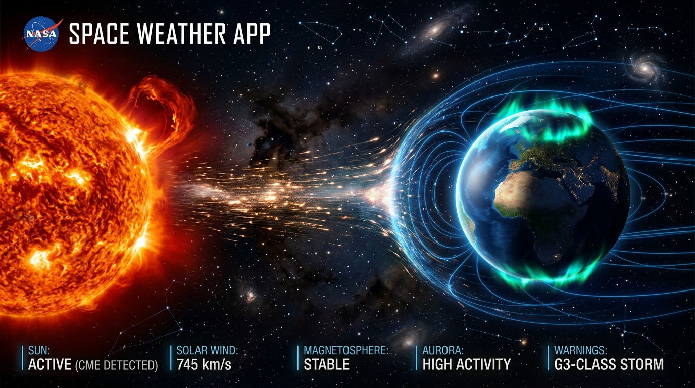
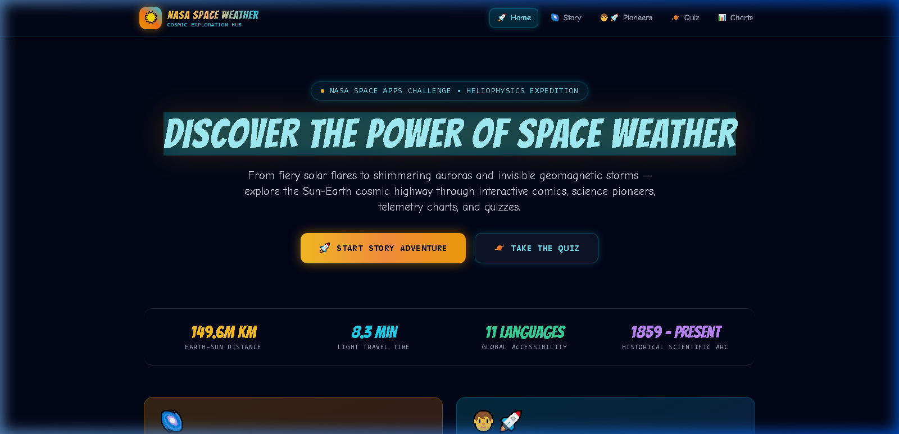
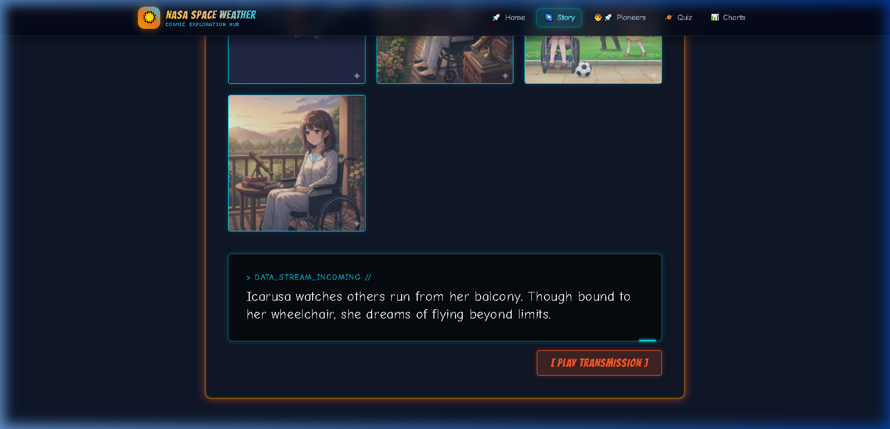
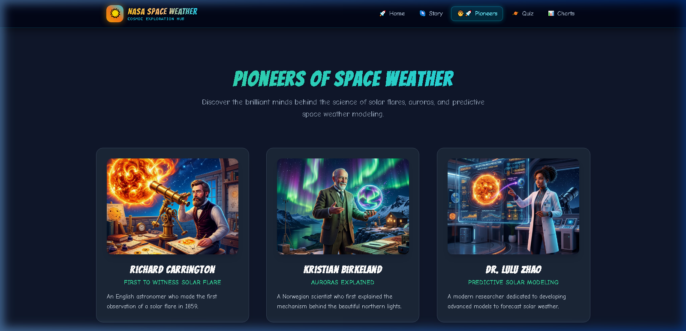
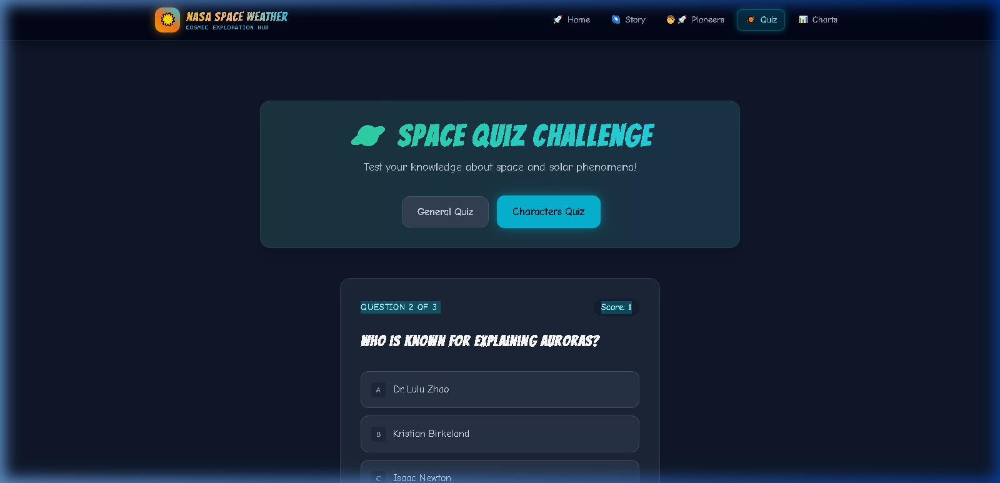
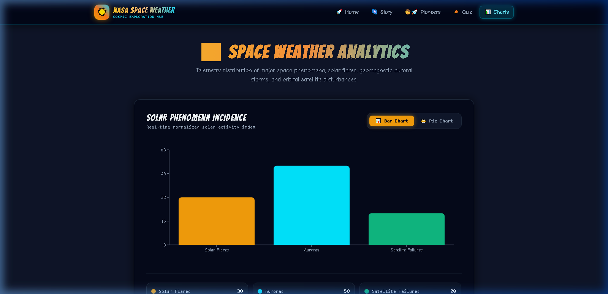

<div align="center">

# ☀️ NASA Space Weather Exploration Hub Hackathon 
### *An Interactive, Multilingual Heliospheric Odyssey*

[](https://github.com/Laiba-dev569/nasa-space-weather-app/actions/workflows/ci.yml)
[](https://github.com/Laiba-dev569/nasa-space-weather-app/actions/workflows/deploy.yml)
[](https://react.dev/)
[](https://vitejs.dev/)
[](https://tailwindcss.com/)
[](https://www.framer.com/motion/)
[](https://recharts.org/)
[](LICENSE)

<br />



<br />

**Explore the cosmic superhighway connecting the Sun and Earth.**  
Immerse yourself in solar flare dynamics, Coronal Mass Ejections (CMEs), geomagnetic storms, and dancing auroras through interactive graphic novels, multilingual voice transmissions, science dossiers, telemetry analytics, and space trivia.

[🚀 Explore Features](#-key-features--screenshot-showcase) • [📖 Story Comic](#2-multilingual-graphic-novel--sci-fi-audio-transmission) • [📊 Telemetry Charts](#5-space-weather-telemetry--analytics) • [⚙️ GitHub Workflows](#-automated-github-workflows-cicd) • [🛠️ Getting Started](#-getting-started)

</div>

---

## 📑 Table of Contents

- [🌌 About the Project](#-about-the-project)
- [✨ Key Features & Screenshot Showcase](#-key-features--screenshot-showcase)
  - [1. High-Tech Cosmic Dashboard](#1-high-tech-cosmic-dashboard)
  - [2. Multilingual Graphic Novel & Voice Comms](#2-multilingual-graphic-novel--sci-fi-audio-transmission)
  - [3. Pioneers of Heliospheric Science](#3-pioneers-of-heliospheric-science)
  - [4. Interactive Space Weather Challenge](#4-interactive-space-weather-challenge)
  - [5. Space Weather Telemetry & Analytics](#5-space-weather-telemetry--analytics)
- [🔭 Heliophysics Science Deep-Dive](#-heliophysics-science-deep-dive)
- [🛠️ Tech Stack & Architecture](#️-tech-stack--architecture)
- [📂 Project Directory Structure](#-project-directory-structure)
- [🚀 Getting Started](#-getting-started)
- [🤖 Automated GitHub Workflows (CI/CD)](#-automated-github-workflows-cicd)
- [🗺️ Roadmap](#️-roadmap)
- [🤝 Contributing](#-contributing)
- [📜 License & Acknowledgments](#-license--acknowledgments)

---

## 🌌 About the Project

Space weather originates 150 million kilometers away in the turbulent, thermonuclear furnace of our Sun. Eruptions such as **Solar Flares** and **Coronal Mass Ejections (CMEs)** fling billions of tons of magnetized plasma across the solar system at speeds exceeding thousands of kilometers per second.

When these solar storms impact Earth's magnetosphere, they trigger majestic **auroras borealis/australis**, but also present critical hazards:
- **Satellite & Telecommunication disruption** (High Frequency radio blackout, GPS scintillation)
- **Power grid induced currents (GICs)** capable of burning high-voltage transformers
- **Radiation risks** to astronauts in low Earth orbit and deep space exploration

The **NASA Space Weather App** bridges cutting-edge space science and public education with an ultra-responsive, gamified, and multilingual graphic platform.

---

## ✨ Key Features & Screenshot Showcase

### 1. High-Tech Cosmic Dashboard
> *A futuristic command center highlighting the Sun-Earth cosmic superhighway, mission metrics, and quick navigation modules.*

- Real-time cosmic constants (149.6M km Earth-Sun distance, 8.3 min photon transit).
- Responsive glassmorphism cards with glowing aurora accents and fluid hover states.
- High-contrast sci-fi typography with curated dark-mode color harmonies.

<div align="center">
  
</div>

---

### 2. Multilingual Graphic Novel & Sci-Fi Audio Transmission
> *Follow "Sunny" the energetic solar particle on an epic voyage from the Sun's core across interplanetary space to Earth's upper atmosphere.*

- **11 Global Languages Supported**: English (`en`), Urdu (`ur`), Turkish (`tr`), Spanish (`es`), Italian (`it`), Hindi (`hi`), Japanese (`ja`), Portuguese (`pt`), Afrikaans (`af`), Arabic (`ar`), French (`fr`).
- **Interactive Speech Synthesis (TTS)**: Built-in voice transmissions allow users to listen to narrated dialogue in their chosen language with one click.
- **Holographic Comic Panels**: Framer Motion staggered viewports and animated glow borders emulate astronaut Heads-Up Displays (HUDs).

<div align="center">
  
</div>

---

### 3. Pioneers of Heliospheric Science
> *Honoring the visionaries who unraveled the mysteries of solar magnetic storms and auroral physics.*

- **Richard Carrington (1859)**: Documented the legendary white-light solar flare and geomagnetic superstorm that caused telegraph lines to spark and auroras visible down to the Caribbean.
- **Kristian Birkeland**: Demonstrated that auroral displays are powered by electrical currents (Birkeland currents) connecting Earth's upper atmosphere to interplanetary space.
- **Dr. Lulu Zhao**: Modern space physicist pioneering predictive machine-learning models to forecast solar energetic particles (SEPs).

<div align="center">
  
</div>

---

### 4. Interactive Space Weather Challenge
> *Gamified trivia challenges to reinforce solar science, atmospheric physics, and heliosphere concepts.*

- Dual Quiz Modes: **General Heliophysics Challenge** and **Pioneers of Space Science Trivia**.
- Real-time progress tracker, dynamic score calculation, and instantaneous feedback badges.
- Smooth animations powered by Tailwind CSS and Framer Motion.

<div align="center">
  
</div>

---

### 5. Space Weather Telemetry & Analytics
> *Data-driven telemetry visualizations illustrating the occurrence and distribution of solar phenomena.*

- Dynamic toggle between **Responsive Bar Charts** and **Interactive Donut/Pie Charts**.
- Custom dark-mode tooltips rendering exact event counts and impact categories.
- Real-time metrics breakdown for Solar Flares, Auroral Storms, and Satellite Anomalies.

<div align="center">
  
</div>

---

## 🔭 Heliophysics Science Deep-Dive

| Cosmic Phenomenon | Typical Speed / Energy | Travel Time to Earth | Terrestrial & Orbital Impact |
|:---|:---|:---|:---|
| **Solar Flare (Electromagnetic Radiation)** | Speed of Light ($c \approx 300,000\text{ km/s}$) | **~8.3 Minutes** | Immediate ionization of Earth's day-side ionosphere; high-frequency radio blackouts (R1–R5 scale). |
| **Solar Energetic Particles (SEPs)** | Up to $0.8c$ (relativistic protons) | **20 Minutes to Several Hours** | Radiation hazard to astronauts, satellite single-event upsets (SEUs), polar cap absorption events (S1–S5 scale). |
| **Coronal Mass Ejections (CMEs)** | $300\text{ km/s}$ to $>2,500\text{ km/s}$ | **15 to 72 Hours** | Severe geomagnetic storms (G1–G5 scale); auroral substorms, electrical grid transformer burnout, pipeline corrosion. |
| **Solar Wind Streams (Coronal Holes)** | $400\text{ km/s}$ to $800\text{ km/s}$ | **Continuous / Recurring** | Recurrent minor to moderate geomagnetic activity, satellite orbital drag enhancement. |

---

## 🛠️ Tech Stack & Architecture

| Layer | Technology | Purpose |
|:---|:---|:---|
| **Core Framework** | [React 19](https://react.dev/) | Component architecture, state hooks, and virtual DOM rendering. |
| **Build & Bundler** | [Vite 7](https://vitejs.dev/) | Ultra-fast Hot Module Replacement (HMR) and optimized Rollup production builds. |
| **Routing** | [React Router 7](https://reactrouter.com/) | Client-side declarative routing (`/`, `/story`, `/characters`, `/quiz`, `/charts`). |
| **Styling & UI** | [Tailwind CSS 3/4](https://tailwindcss.com/) | Curated dark sci-fi color palette, cosmic glow keyframes, and glassmorphism utilities. |
| **Animations** | [Framer Motion 12](https://www.framer.com/motion/) | Staggered entrance transitions, interactive card hover states, and smooth layout changes. |
| **Data Visualization**| [Recharts 3](https://recharts.org/) | Responsive SVG Bar and Pie charts with customized cosmic tooltips. |
| **Audio Engine** | [Web Speech API](https://developer.mozilla.org/en-US/docs/Web/API/Web_Speech_API) | Cross-browser text-to-speech engine supporting 11 languages without external dependencies. |
| **CI / CD Workflows** | [GitHub Actions](https://github.com/features/actions) | Automated linting, test builds, and GitHub Pages continuous deployment. |

---

## 📂 Project Directory Structure

```text
nasa-space-weather-app/
├── .github/
│   └── workflows/
│       ├── ci.yml                 # Continuous Integration (Lint + Build)
│       └── deploy.yml             # GitHub Pages automated deployment
├── docs/
│   ├── assets/
│   │   └── banner.jpg             # High-res widescreen README hero banner
│   └── screenshots/
│       ├── 01-hero-dashboard.png
│       ├── 02-multilingual-comic-story.png
│       ├── 03-space-pioneers.png
│       ├── 04-interactive-quiz.png
│       └── 05-telemetry-analytics.png
├── public/
│   ├── images/                    # Character portraits & comic illustrations
│   └── vite.svg
├── src/
│   ├── assets/                    # Project icons and static assets
│   ├── components/
│   │   ├── CharacterCard.jsx      # Pioneer biography card component
│   │   ├── Charts.jsx             # Recharts Bar & Pie telemetry visualizer
│   │   ├── ComicPanel.jsx         # Holographic story panel with TTS
│   │   ├── Navbar.jsx             # Glassmorphic sci-fi navigation header
│   │   ├── Quiz.jsx               # Gamified question engine
│   │   └── Story.jsx              # Multilingual story container
│   ├── data/
│   │   ├── characterQuizData.js   # Pioneer trivia bank
│   │   ├── chartsData.js          # Space weather telemetry statistics
│   │   ├── impactsData.js         # Historical scientists dossiers
│   │   ├── quizData.js            # General heliophysics questions
│   │   └── storyData.js           # 11-language graphic novel dialogue script
│   ├── hooks/
│   │   └── useTTS.js              # Web Speech API custom hook
│   ├── pages/
│   │   ├── CharactersPage.jsx     # Pioneers of Science view
│   │   ├── ChartsPage.jsx         # Telemetry & Analytics view
│   │   ├── HomePage.jsx           # Mission Dashboard & Hero Portal
│   │   ├── QuizPage.jsx           # Space Challenge view
│   │   └── StoryPage.jsx          # Interactive Graphic Novel view
│   ├── App.jsx                    # Root application component & layout
│   ├── index.css                  # Tailwind styles & cosmic animations
│   └── main.jsx                   # React entry point
├── package.json                   # Dependencies and npm scripts
├── tailwind.config.js             # Cosmic color tokens & animation keyframes
└── vite.config.js                 # Rollup chunking & relative base configuration
```

---

## 🚀 Getting Started

### Prerequisites
- **Node.js**: v18.0.0 or higher (v20.x recommended)
- **npm**: v9.0.0 or higher

### Local Installation

1. **Clone the repository:**
   ```bash
   git clone https://github.com/Laiba-dev569/nasa-space-weather-app.git
   cd nasa-space-weather-app
   ```

2. **Install project dependencies:**
   ```bash
   npm install
   ```

3. **Start the local development server:**
   ```bash
   npm run dev
   ```
   Open your browser and navigate to `http://localhost:5173/`.

4. **Build for production:**
   ```bash
   npm run build
   ```
   The optimized production bundle will be generated in the `dist/` directory.

5. **Preview production build locally:**
   ```bash
   npm run preview
   ```

> [!TIP]
> **Windows Users**: If executing `npm` scripts in PowerShell triggers execution policy errors, run using `cmd.exe /c "npm run dev"` or execute `Set-ExecutionPolicy -Scope CurrentUser -ExecutionPolicy RemoteSigned`.

---

## 🤖 Automated GitHub Workflows (CI/CD)

The project includes two pre-configured, production-grade GitHub Actions workflows located in `.github/workflows/`:

### 1. `ci.yml` — Continuous Integration
Runs automatically on every `push` and `pull_request` targeting `main` or `master`:
- Checks out the repository code.
- Sets up Node.js with dependency caching.
- Installs packages via clean `npm ci`.
- Runs ESLint validation.
- Executes `npm run build` to guarantee zero build breakage before merging.

### 2. `deploy.yml` — GitHub Pages Deployment
Deploys the static production build directly to **GitHub Pages** upon every push to `main`:
- Automatically builds the application bundle using Vite's relative base configuration (`base: './'`).
- Bundles distribution assets via `actions/upload-pages-artifact`.
- Deploys safely with concurrency control via `actions/deploy-pages`.

#### How to Enable GitHub Pages on your Fork:
1. Go to your repository on GitHub.
2. Navigate to **Settings** > **Pages**.
3. Under **Build and deployment** > **Source**, select **GitHub Actions**.
4. Push to `main` — your site will deploy live at `https://<your-username>.github.io/nasa-space-weather-app/`!

---

## 🗺️ Roadmap

- [x] Multilingual comic reader with 11 language support.
- [x] Text-to-Speech audio transmission playback.
- [x] Interactive Space Weather Quiz with category selection.
- [x] Telemetry analytics with dynamic Bar/Pie visualizations.
- [x] Automated GitHub Actions CI and Pages deployment workflows.
- [ ] Live integration with NASA DONKI (Database of Notifications, Knowledge, and Information) API.
- [ ] 3D interactive Solar System view with Three.js / WebGL.
- [ ] Push notification alerts for incoming solar storms (Kp $\ge$ 5).

---

## 🤝 Contributing

Contributions make the open-source space community thrive! If you'd like to improve the app, add more comic scenes, or expand translations:

1. **Fork the Project**
2. **Create your Feature Branch**:
   ```bash
   git checkout -b feature/CosmicFeature
   ```
3. **Commit your Changes**:
   ```bash
   git commit -m "feat: add real-time solar wind speed tracker"
   ```
4. **Push to the Branch**:
   ```bash
   git push origin feature/CosmicFeature
   ```
5. **Open a Pull Request**

---

## 📜 License & Acknowledgments

Distributed under the **MIT License**. See `LICENSE` for more details.

### Acknowledgments & Scientific Data Sources
- **NASA Heliophysics Science Division** & [NASA Open Data Portal](https://data.nasa.gov/)
- **Solar Dynamics Observatory (SDO)** & **SOHO (Solar and Heliospheric Observatory)**
- **NOAA Space Weather Prediction Center (SWPC)** for solar storm scale definitions
- Built with passion for the **NASA Space Apps Challenge** 🚀
